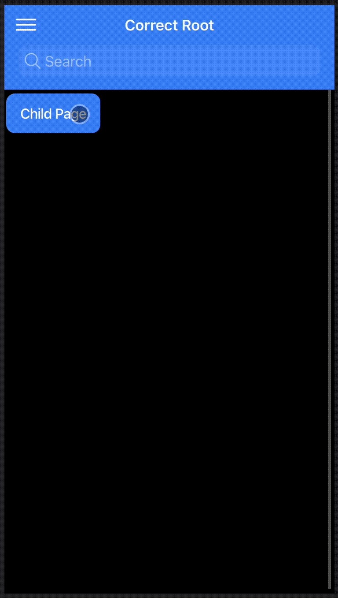

# Proper Page Structure for Ionic Framework
This repository was created to demonstrate how the header area of an Ionic application breaks when the page structure is not implemented correctly. Pages can have three root-level components as explained in our [docs](https://ionicframework.com/docs/layout/structure#header-and-footer): `ion-header`, `ion-content`, `ion-footer`.

Specifically this showcases the issues that arise from attempting to use a custom component to share a common header logic across multiple pages. This pattern is not officially supported as features such as [ion-back-button](https://ionicframework.com/docs/api/back-button) and navigation transition animations rely on pages containing the appropriate structure.

## Prerequisites
To make the issue more apparent, it's recommended to use the device emulator in Chrome dev tools so the app is running in iOS mode (the page navigation animations are more dramatic).

## Problems that arise
When the page structure is not correct, the animations that occur within the header area during a navigation event no longer work. In addition, `ion-back-button` will not automatically appear as expected like it should out-of-the-box. The behavior can be compared between a proper implementation versus using a custom "shared" header component in the screecasts below:

### Pages with separate headers

  

### Pages with a custom "shared header" component

  

